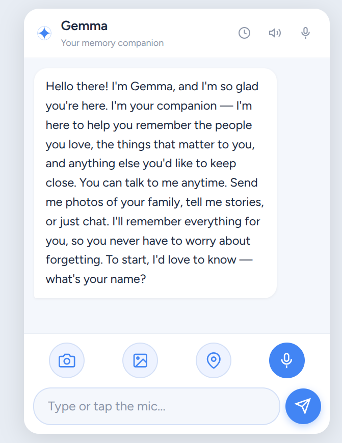

# Gemma Remember

> A warm, voice-first memory companion for people living with dementia — and the families who love them. Powered by **Gemma 4**.

[](https://gemma-remember-apk.vercel.app)
[](https://github.com/Javierg720/gemma-remember-apk/releases/latest)
[](notebooks/gemma-remember-rag-for-dementia-care.ipynb)

<p align="center">
  
</p>

---

## Try it now

| Want to… | Go here |
| --- | --- |
| **Chat with Gemma in your browser** (no install) | https://gemma-remember-apk.vercel.app |
| **Install on Android** | [Latest APK release](https://github.com/Javierg720/gemma-remember-apk/releases/latest) |
| **Reproduce the RAG research** | [`notebooks/gemma-remember-rag-for-dementia-care.ipynb`](notebooks/gemma-remember-rag-for-dementia-care.ipynb) |

The web demo asks for a free Gemini API key on first load — get one at https://aistudio.google.com/apikey. The APK has a **Cloud** mode (same key) and an **On-Device** mode that downloads Gemma 4 (~2.6 GB) for fully offline use.

---

## What it does

- **Remembers the people who love you.** Snap a photo of family, tell Gemma who they are, and she recalls them later when you ask.
- **Voice-first.** Tap the orb in the header for hands-free conversation — Microsoft Edge TTS (Emma voice) on the web; Web Speech API + on-device Android TTS as fallbacks.
- **Persistent memory.** People, reminders, and conversation history survive page refreshes and app restarts (`localStorage` on web, Room DB on native).
- **Gentle orientation.** Day, time, and season anchors woven into responses — never condescending.
- **Repeat-question tolerance.** Never says *"as I mentioned"*. Each ask gets a fresh, patient answer.
- **Lost? Send to family.** GPS sharing prompts *"Are you lost? Send your location to family?"* then fires an SMS with a Maps link — never speaks raw URLs.
- **Caregiver-aware.** Gemma can pre-write messages to anyone she's been told about, and call the doctor.

---

## Architecture

```
┌─────────────────┐      ┌─────────────────┐      ┌──────────────────┐
│  Capacitor APK  │      │  Vercel Web App │      │ Kaggle Notebook  │
│  (Android 8+)   │      │  (static + py)  │      │  (RAG research)  │
└────────┬────────┘      └────────┬────────┘      └──────────────────┘
         │                        │
         └──────────┬─────────────┘
                    │
        ┌───────────▼────────────┐
        │  Gemma 4 26B A4B (it)  │  ← Cloud mode (Gemini API)
        │  Gemma 4 2B (LiteRT)   │  ← On-device mode (offline)
        └────────────────────────┘
```

**Stack:** Capacitor 8 · Gemma 4 (Gemini API + LiteRT) · Microsoft Edge TTS · Web Speech API · Vercel Python serverless · WebView mic permissions via `WebChromeClient`.

---

## Run locally

```bash
git clone https://github.com/Javierg720/gemma-remember-apk
cd gemma-remember-apk
python3 src/server.py            # serves static + Edge TTS on :3000
open http://localhost:3000
```

Build the APK:

```bash
npm install
npx cap sync android
cd android && ./gradlew assembleRelease
# → android/app/build/outputs/apk/release/app-release.apk
```

---

## Repo layout

```
src/                     Web app (HTML/CSS/JS) — served by Vercel and Capacitor
  app.js                 Chat, memory, voice, vision, action-tag parsing
  visualizer.html        Voice-mode orb (calm Companion style)
  server.py              Local dev: static + Edge TTS proxy
api/tts.py               Vercel serverless: edge-tts → MP3
android/                 Capacitor Android shell + GemmaPlugin (LiteRT)
notebooks/               Kaggle notebook — RAG dementia-care research
vercel.json              Static `src/` + rewrite `/tts` → `/api/tts`
```

---

## License

Apache 2.0 — same license as Gemma 4. See [LICENSE](LICENSE).

Built for the **Gemma 4 Good Hackathon 2026**. Made with care, for the people we don't want to forget.
